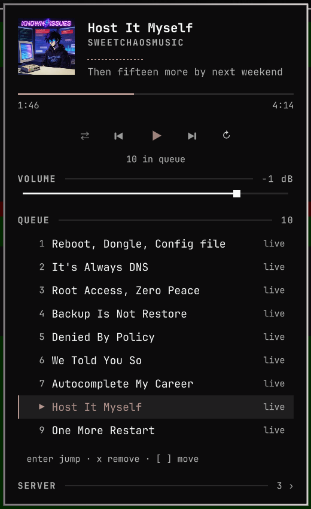
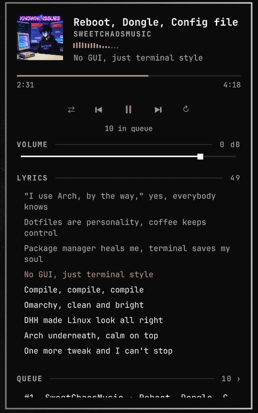
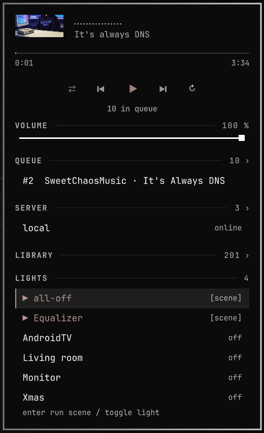

# Remote Cliamp

[cliamp](https://www.cliamp.stream/) players on other machines, controlled from the
Omarchy bar. A fork of [omarchy-cliampui](https://github.com/thisisgm/omarchy-cliampui)
with the machine boundary moved: the audio, the player and the queue live on a
server; this panel only sends verbs. One widget drives any number of servers,
every server keeps its own tunnel and heartbeat alive, so switching is instant
and the picker shows live state per server.

Remote is opt-in, not required: with no configuration at all the widget drives
the cliamp on localhost (a built-in `local` server, no ssh involved), so it also
works as a plain local cliamp panel out of the box.

<p align="center">
  
  
</p>
<p align="center">
  <sub>More: <a href="docs/00-panel.png">the panel, playing</a> ·
  <a href="docs/02-server-picker.png">server picker</a> ·
  <a href="docs/03-search.png">library search</a> ·
  <a href="docs/06-sections.png">every section at once</a></sub>
</p>

https://github.com/user-attachments/assets/4a53aa4f-3a55-4ff1-a7ac-a6c00007316e

Music: "Reboot, Dongle, Config file" by sweetchaosmusic © — not covered by the MIT license.

## Install

```bash
omarchy plugin add https://github.com/orsa86/omarchy-remote-cliamp.git
```

The command validates the manifest, asks where to place the widget, and the bar
picks it up immediately. Update later with `omarchy plugin update orsa.remote-cliamp`;
remove with `omarchy plugin remove orsa.remote-cliamp` (your `shell.json` entry
is yours — removal does not touch the rest of your bar configuration).

## Getting started

With no configuration the widget already controls the cliamp on **localhost** —
install it, click the bar icon, press play. Nothing else to set up.

To add a remote server, open `~/.config/omarchy/shell.json` — the file the whole
bar is configured in — and find the widget's entry in the bar layout (it carries
`"id": "orsa.remote-cliamp"`; the id names the plugin, leave it as it is). Give
the entry a `servers` list — the local player plus one machine over ssh — and
optionally a `ledfxUrl` if a [LedFx](https://ledfx.app) instance runs somewhere:

```jsonc
{
  "id": "orsa.remote-cliamp",                              // fixed — names the plugin
  "activeServer": "local",
  "servers": [
    { "label": "local", "sshTarget": "local" },            // localhost, works with nothing else
    { "label": "livingroom", "sshTarget": "user@livingroom.lan" }  // optional: any machine over ssh
  ],
  "ledfxUrl": "http://lights.lan:8888"                     // optional: LedFx → LIGHTS section
}
```

(The comments are illustration only — `shell.json` is plain JSON, leave them
out when pasting.)

The shell hot-reloads the file on save; both servers appear in the panel's
SERVER section (`o`, or the wheel on the bar icon switches), and the `ledfxUrl`
adds a [LIGHTS section](#lights-ledfx) — drop the line if you have no LedFx.
The full reference lives in [Configuration](#configuration).

### Setting up a remote server

The server needs exactly two things: passwordless ssh in, and a cliamp
(**>= 1.63**) owning its socket.

**1. ssh.** The plugin runs ssh non-interactively (`BatchMode=yes`), so key
auth has to work without any prompt. One-time setup from your desktop:

```bash
ssh-keygen -t ed25519          # skip if you already have a key
ssh-copy-id user@livingroom.lan
ssh -o BatchMode=yes user@livingroom.lan true && echo ok   # must print "ok"
```

Anything ssh itself understands works — a `Host` alias from `~/.ssh/config`,
a port, a jump host — the plugin just passes `sshTarget` to ssh:

```
Host livingroom.lan
  User music
  IdentityFile ~/.ssh/id_ed25519
```

**2. cliamp.** On the server:

```bash
cliamp --version               # >= 1.63 (older ones have no IPC socket)
cliamp --daemon                # or run the TUI in a tmux — either owns the socket
```

No sudo on the server? An unprivileged upgrade works:
`cp /usr/local/bin/cliamp ~/.local/bin/ && ~/.local/bin/cliamp --upgrade`.

Nothing has to be running up front: when the socket is free, the panel's
"Start cliamp daemon on server" row (`f`) starts the daemon over ssh.

## Search

One field, modelled on cliamp's own Ctrl+F and `/`:

- **Server search** (search3): songs, albums, and artists — browsed the way the
  native provider browser browses. `Enter` on an **artist** opens their albums;
  `Enter` on an **album** opens its tracks; `Enter` on a **track** in there
  plays it and queues the rest of the album from that point. Each screen's
  first rows are "▶ Play all by …" / "▶ Play album from the top", the
  breadcrumb shows where you are, `Backspace` walks back one level.
- **Saved playlists** are matched **fuzzily**, the way cliamp's local `/`
  filter works: query characters need only appear in order — `skr` finds
  "Sakura" — ranked by relevance.
- **Radio**: a bare `r:` (or `radio:`) lists the server's own stations — the
  radios.toml entries, the built-in "cliamp radio" list, and favorites.
  `r: <query>` searches the Radio Browser directory instead, the same one
  cliamp's `R` key browses.

Everywhere the actions are the native search-overlay set: `Enter` plays now
(replaces the queue), `a` / `q` (or right click) queue without touching what is
playing — songs, whole albums, radio stations, or an artist's entire catalogue.

## Queue

The panel's version of the native playlist view. Collapsed it shows the playing
row; `A`, the section header, or the "N in queue" line expand it. Inside: the
playing track is marked `▶`, `Enter` jumps to a row, `x` removes it, `[`/`]`
move it. Every mutation's reply carries the fresh list and it re-reads once per
track change, so it never goes stale.

## Volume

Where the slider points depends on where the player is:

- **Remote server** — cliamp's own gain over the socket, in dB ([-30, +6], the
  range its `+`/`-` keys walk). Right click returns it to 0 dB. The line turns
  urgent while the gain sits above 0 dB — positive digital gain clips.
- **`local` server** — the PipeWire volume of cliamp's own playback stream
  (shown in %, capped at 100%, right click restores it): float, ramped, cannot
  clip, and the socket gain is left alone at 0.

## Lyrics

`y` opens the lyric sheet, the same key the native player uses. The line the
server is on is the highlighted one and the sheet follows it, so scrolling is
only needed to read ahead; the count in the header is how many lines were
found. `r` retries the lookup while the sheet is open, for the tracks whose
lyrics show up late.

The timing comes off the server's own playback clock. Nothing here can measure
the latency of a sink in another room, so if the lines run early or late,
`lyricTrimMs` shifts them by hand (see [Configuration](#configuration)).

## Lights (LedFx)



Optional: point `ledfxUrl` at a [LedFx](https://ledfx.app) instance (see
[Getting started](#getting-started)) and `L` opens a LIGHTS section — LedFx
scenes as one-shot actions and every WLED virtual with a live active/off
toggle, so the room lights react to whatever is playing.

Plain HTTP(S) against LedFx's own REST API; no ssh involved. An empty URL
hides the section entirely.

<br clear="right">

## How it works

cliamp speaks newline-delimited JSON on a unix socket. The plugin holds one
`ssh -N -L` per configured server, forwarding that socket to
`$XDG_RUNTIME_DIR/remote-cliamp.<label>.sock`, and talks to it exactly the way
the local plugin talks to a local cliamp. Status, transport, seek, lyrics and
playlist loads all ride that one tunnel; the spectrum analyzer is
`cliamp visstream` run over ssh while the panel is open.

The tunnel doubles as an ssh ControlMaster (`remote-cliamp.<label>.ctl`), so
every other ssh the plugin makes is a channel on the already-open connection:
~20 ms instead of a full ~1.7 s handshake per call.

Audio never crosses the wire — the server pulls its own streams (Navidrome,
radio) and plays them on its own output. The library is browsed from localhost,
straight off the Subsonic server, using the salted token the remote cliamp
publishes in its status, so no password is ever handled.

### What did not survive the distance

Everything the local plugin reads out of PipeWire describes an audio graph on
the far machine, so it has no remote counterpart here: the bit-perfect verdict,
the level meter, output routing, and rate following. Lyrics are shown, but the
sink whose latency would align them is in another room, so only the manual trim
applies.

## Configuration

Everything lives in the widget's entry in `~/.config/omarchy/shell.json` (see
[Getting started](#getting-started)). A fuller example with a per-server
override:

```json
{
  "id": "orsa.remote-cliamp",
  "activeServer": "livingroom",
  "servers": [
    { "label": "livingroom", "sshTarget": "user@livingroom.lan" },
    { "label": "attic", "sshTarget": "user@attic.lan",
      "remoteCliamp": "/usr/local/bin/cliamp" }
  ]
}
```

Per server:

| Field | Required | Default | Meaning |
| --- | --- | --- | --- |
| `label` | yes | — | names the server everywhere |
| `sshTarget` | yes | — | `user@host`, or `local` for this machine |
| `remoteCliamp` | no | `~/.local/bin/cliamp` | cliamp binary on the server |
| `remoteSocket` | no | `.config/cliamp/cliamp.sock` | socket path; a relative path is anchored to the remote home (probed once — sshd only forwards absolute socket paths) |

`"sshTarget": "local"` is a server without the wire: the plugin connects
straight to `~/.config/cliamp/cliamp.sock` and runs helper commands as local
subprocesses. Whatever cliamp owns that socket — the TUI in a terminal, or a
daemon — is what the panel controls, attaching and detaching on its own.

Shared settings (also editable in the shell's settings UI):

| Setting | Default | Meaning |
| --- | --- | --- |
| `activeServer` | first server | written back automatically when picked in the panel, so the choice survives a shell restart |
| `ledfxUrl` | `""` | LedFx instance for the LIGHTS section; empty hides it |
| `statusIntervalSec` | `2` | poll while the panel is open (a 10 s heartbeat runs per server regardless, keeping the picker live) |
| `hideWhenOffline` | `false` | hide the bar icon while the active server is unreachable |
| `lyricTrimMs` | `0` | manual lyric timing trim |

The old one-server-per-entry shape (`label`/`sshTarget` directly on the entry)
still loads as a single server.

## Keyboard

The keys are cliamp's own, minus what has no remote meaning (no `p` — no rate
following).

### Panel

| Key | Action |
| --- | --- |
| `space` / `enter` | play-pause |
| `n` / `b` | next / previous track |
| `h` / `l` | seek back / forward (streams cannot seek) |
| `s` / `r` | shuffle / cycle repeat |
| `+` / `-` | volume — 1 dB steps remote, 5% steps local (`=` counts as `+`) |
| `/` | library search |
| `o` | server picker (`j`/`k` + `enter` to switch) |
| `A` | queue |
| `y` | lyrics (`r` retries the lookup while it is open) |
| `L` | lights (when `ledfxUrl` is set) |
| `f` | start the cliamp daemon on the server |
| `?` / `Ctrl+K` | in-panel keymap |
| `esc` | close (open sections collapse first) |

### Search

The native two-zone flow: `/` always means "type a query" — it opens the
library and focuses the field, or refocuses it.

| Key | Action |
| --- | --- |
| `esc` | hand the keyboard from the field to the results; again closes the panel |
| `j` / `k`, `Ctrl+N` / `Ctrl+P` | move the cursor (the Ctrl pair works while typing) |
| `Ctrl+D` / `Ctrl+U`, `PageDown` / `PageUp` | scroll by page (in the results) |
| `enter` | play the row (replaces the queue) |
| `a` / `q` / right click | queue the row without touching what plays |
| `backspace` | walk out of an artist / album drill-down |
| `Ctrl+W` | delete the previous word (in the field) |
| `Ctrl+U` | clear before the cursor (in the field) |

### Bar icon

| Input | Action |
| --- | --- |
| click | open / close the panel |
| right click | play-pause without opening |
| wheel | cycle through the servers |

The icon is bright while playing, dim while reachable and idle, dimmer still
while the server is unreachable.

## IPC

```bash
omarchy-shell remote-cliamp open|close|toggle|playpause
omarchy-shell remote-cliamp server <label>        # switch server
omarchy-shell remote-cliamp library|queuepanel|serverpanel|lyrics|lights
omarchy-shell remote-cliamp search "<query>"
omarchy-shell remote-cliamp scene <name>          # run a LedFx scene
```
