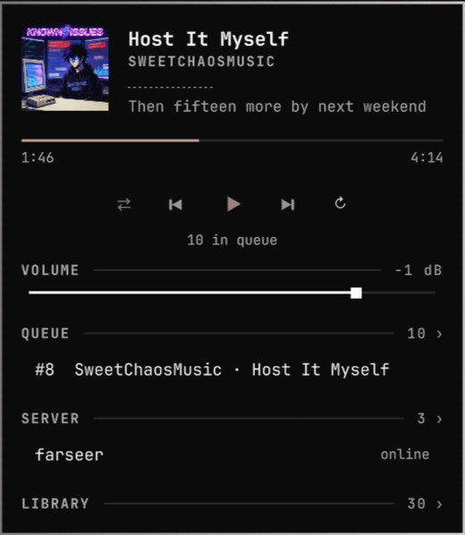

# Remote Cliamp

[cliamp](https://www.cliamp.stream/) players on other machines, controlled from the
Omarchy bar. A fork of [omarchy-cliampui](https://github.com/thisisgm/omarchy-cliampui)
with the machine boundary moved: the audio, the player and the queue live on a server;
this panel only sends verbs. One widget drives any number of servers — a SERVER
section in the panel (or the wheel on the bar icon) switches between them, and every
server keeps its own tunnel and heartbeat alive so switching is instant and the picker
shows live state per server.

Remote is opt-in, not required: with no configuration at all the widget drives the
cliamp on localhost (a built-in `local` server, no ssh involved), so it also
works as a plain local cliamp panel out of the box.

<p align="center">
  
  
</p>
<p align="center">
  <sub>More: <a href="docs/02-server-picker.png">server picker</a> ·
  <a href="docs/03-search.png">library search</a> ·
  <a href="docs/04-lights.png">lights</a></sub>
</p>


https://github.com/user-attachments/assets/4a53aa4f-3a55-4ff1-a7ac-a6c00007316e

Music: "Reboot, Dongle, Config file" by sweetchaosmusic © — not covered by the MIT license.

## Install

```bash
omarchy plugin add https://github.com/orsa86/omarchy-remote-cliamp.git
```

The command validates the manifest, asks where to place the widget, and the
bar picks it up immediately. Update later with `omarchy plugin update
orsa.remote-cliamp`.

## Getting started

With no configuration the widget already controls the cliamp on **localhost**
— install it, click the bar icon, press play. Nothing else to set up.

To add a remote server, open `~/.config/omarchy/shell.json` — the file the
whole bar is configured in — and find the widget's entry in the bar layout
(it carries `"id": "orsa.remote-cliamp"`; the id names the plugin, leave it
as it is). Give the entry a `servers` list — the local player plus one
machine over ssh:

```json
{
  "id": "orsa.remote-cliamp",
  "activeServer": "local",
  "servers": [
    { "label": "local", "sshTarget": "local" },
    { "label": "livingroom", "sshTarget": "user@livingroom.lan" }
  ]
}
```

The shell hot-reloads the file on save; both servers appear in the panel's
SERVER section (`o`, or the wheel on the bar icon switches). The full
per-server reference lives in [Configuration](#configuration).

## How it reaches the server

cliamp speaks newline-delimited JSON on a unix socket. The plugin holds one
`ssh -N -L` per configured server, forwarding that socket to
`$XDG_RUNTIME_DIR/remote-cliamp.<label>.sock`, and talks to it exactly the way the
local plugin talks to a local cliamp. Status, transport, seek, lyrics and playlist
loads all ride that one tunnel. The spectrum analyzer is `cliamp visstream` run over
ssh while the panel is open. Shuffle and repeat go through the remote CLI, which has
no socket verb.

The tunnel doubles as an ssh ControlMaster (`remote-cliamp.<label>.ctl`), so every
other ssh the plugin makes — verbs, visstream, playlist writes — is a channel on the
already-open connection: ~20 ms instead of a full ~1.7 s handshake per call.

Audio never crosses the wire. The server pulls its own streams (Navidrome, radio)
and plays them on its own output.

The library is browsed from localhost, straight off the Subsonic server, using the
salted token the remote cliamp publishes in its status — the same trick as the local
plugin, so no password is ever handled. Playing an album writes the `cliampui` scratch
playlist onto the server over ssh and loads it there.

## Search

One field, modelled on cliamp's own Ctrl+F and `/`:

- **Server search** (search3): songs, albums, and artists — browsed the way the
  native provider browser browses. `Enter` on an **artist** opens their albums;
  `Enter` on an **album** opens its tracks; `Enter` on a **track** in there plays it
  and queues the rest of the album from that point (cliamp cannot jump within a
  queue, so "the rest" starts at the chosen track). Each screen's first rows are
  "▶ Play all by …" / "▶ Play album from the top" (`p` does the latter, like the
  native track screen). `Backspace` or the `‹` row walks back one level; the
  breadcrumb shows where you are. `a`/`q` queue whatever the row holds — a track, an
  album, or an artist's entire catalogue.
- **Saved playlists** are matched **fuzzily**, the way cliamp's local `/` filter works:
  query characters need only appear in order — `skr` finds "Sakura" — ranked by
  relevance. While a server round trip is in flight, the rows already on screen are
  re-ranked fuzzily against the new query instead of sitting stale.
- **Radio**: a bare `r:` (or `radio:`) lists the server's own configured stations —
  the radios.toml entries, the built-in "cliamp radio" list, and favorites, read from
  the radio provider over the socket. `r: <query>` searches the Radio Browser
  directory instead, the same one cliamp's `R` key browses. Either way `Enter` plays
  the station on the server and `q` queues it.

Result actions, the native search-overlay set: `Enter` plays now (replaces the
queue), `a` / `q` (or right click) queue without touching what is playing — songs,
whole albums, and radio stations alike, delivered as `{"cmd":"queue"}` over the
socket.

The volume slider depends on where the player is. On a remote server it moves
cliamp's own gain over the socket, in dB ([-30, +6], the same range its `+`/`-`
keys walk); right click returns it to 0 dB, and the line turns urgent while the
gain sits above 0 dB — positive digital gain clips. On the `local` server the
slider drives the PipeWire volume of cliamp's own playback stream instead
(shown in %, capped at 100%, right click restores it): float, ramped, cannot
clip, and the socket gain is left alone at 0.

## Lights (LedFx)

Optional: point `ledfxUrl` at a [LedFx](https://ledfx.app) instance
(`"ledfxUrl": "http://lights.lan:8888"` on the shell.json entry) and `L` opens a
LIGHTS section — LedFx scenes as one-shot actions and every WLED virtual with a
live active/off toggle, so the room lights react to whatever is playing. Plain
HTTP(S) against LedFx's own REST API; no ssh involved. Empty URL hides the
section entirely. IPC: `omarchy-shell remote-cliamp lights` and
`omarchy-shell remote-cliamp scene <name>`.

## Queue

A QUEUE section, the panel's version of the native playlist view, fed by the
socket's `queue.*` verbs. Collapsed it shows the playing row (`#4 Artist · Title`);
`A` (native's queue-manager key), the section header, or the "N in queue" line under
the transport expand it. Inside: the playing track is marked `▶`, `Enter` (or a
click) jumps to a row, `x` (or a right click) removes it, `[`/`]` move it. Every
mutation's reply carries the fresh list, and it re-reads once per track change while
the panel is open, so it never goes stale.

## What did not survive the distance

Everything the local plugin reads out of PipeWire describes an audio graph on the far
machine, so it has no remote counterpart here: the bit-perfect verdict, the level
meter, output routing, rate following, and the stream volume slider. Lyrics are shown,
but the sink whose latency would align them is in another room, so only the manual
trim applies.

## Requirements

- Key-based ssh to the server that works with `BatchMode=yes` (no password prompts).
- cliamp **>= 1.63** on the server. An unprivileged
  install works: `cp /usr/local/bin/cliamp ~/.local/bin/ && ~/.local/bin/cliamp --upgrade`.
- Something running on the server that owns the socket: the TUI in a tmux, or
  `cliamp --daemon`. The panel's "Start cliamp daemon on server" row does the latter
  over ssh when the socket is free.

## Configuration

Everything lives in the widget's entry in `~/.config/omarchy/shell.json`
(see [Getting started](#getting-started) for where that is). The servers are
a list; a fuller example with a per-server override:

```json
{
  "id": "orsa.remote-cliamp",
  "activeServer": "livingroom",
  "servers": [
    { "label": "livingroom", "sshTarget": "user@livingroom.lan" },
    { "label": "attic", "sshTarget": "user@attic.lan",
      "remoteCliamp": "/usr/local/bin/cliamp" }
  ]
}
```

With no configuration at all the widget defaults to one `local` server, so it works
the moment it lands in the bar — configuration is only for adding remote machines.

`"sshTarget": "local"` is a server without the wire: the plugin connects straight to
`~/.config/cliamp/cliamp.sock` and runs helper commands as local subprocesses. Any
cliamp owns that one per-user socket — the TUI you start in a terminal, or a daemon —
so whatever is running is what the panel controls, attaching and detaching on its own.

Per server: `label` (required, names it everywhere), `sshTarget` (required),
`remoteCliamp` (default `~/.local/bin/cliamp`), `remoteSocket` (default
`.config/cliamp/cliamp.sock`; relative paths are anchored to the remote home, probed
once over ssh, since sshd only forwards absolute socket paths).

`activeServer` is written back automatically when a server is picked in the panel,
so the choice survives a shell restart. Shared settings (also in the settings UI):
`statusIntervalSec` (poll while the panel is open; a 10 s heartbeat runs regardless,
per server, so the picker states stay live), `hideWhenOffline`, `lyricTrimMs`.

The old one-server-per-entry shape (`label`/`sshTarget` directly on the entry) still
loads as a single server.

## Keyboard

Same as the local plugin, minus what has no remote meaning: `space`/`enter`
play-pause, `n`/`b` next and back, `h`/`l` seek (inert on streams), `s` shuffle,
`r` repeat, `+`/`-` volume 1 dB at a time (native cliamp's keys; `=` counts as `+`),
`/` library, `o` the server picker (`j`/`k` + enter to switch),
`f` start the remote daemon, `?` or `Ctrl+K` the in-panel keymap (native cliamp's
own help keys), `esc` close. No `p` (no rate following).

In the search, the native two-zone flow: `/` always means "type a query" (it opens
the library and focuses the field, or refocuses it), `esc` hands the keyboard from
the field to the results list, a second `esc` closes the panel. Navigation matches
cliamp's overlay: `j`/`k` or `Ctrl+N`/`Ctrl+P` move the cursor (the Ctrl pair works
while typing too), `Ctrl+U`/`Ctrl+D` or `PageUp`/`PageDown` scroll by page,
`Enter` plays, `a`/`q` queue the highlighted row, `Backspace` walks out of an artist
drill-down. In the field itself: `Ctrl+W` deletes the previous word, `Ctrl+U` clears
before the cursor — cliamp's text-input keys.

Bar icon: bright while playing, dim while reachable and idle, dimmer still while the
server is unreachable. Right click play-pauses without opening the panel; the wheel
cycles through the servers.

## IPC

`omarchy-shell remote-cliamp open|close|toggle|playpause|library`, and
`omarchy-shell remote-cliamp server <label>` to switch servers.
